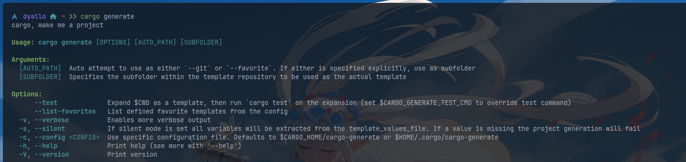
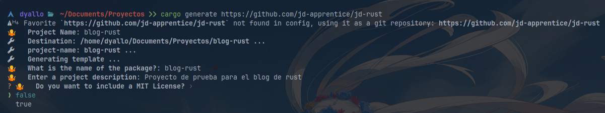
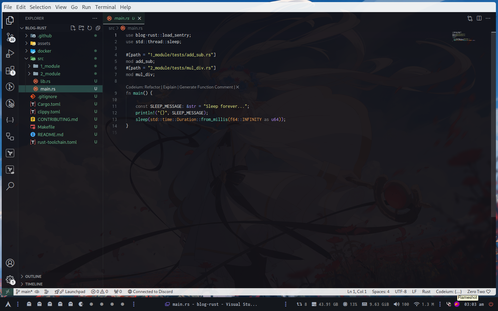

## Que es cargo generate?

Cargo generate es una herramienta que te permite crear proyectos basados en el sistema de templates `Liquid` el mismo es similar a Jinja2.

El mismo utiliza un archivo llamado `cargo-generate.toml` en la raiz de tu proyecto para configurar el proyecto.

Un ejemplo de como se veria

```toml
[placeholders.package_name]
type = "string"
prompt = "What is the name of the package?"

[placeholders.package_description]
type = "string"
prompt = "Enter a project description"
```

## Instalación

Para poder usarlo tendriamos que instalarlo, podemos hacerlo con nuestro manejador de paquetes en mi caso es `pacman -S cargo-generate`.

Termina quedando accesible con `cargo generate` a nivel sistema



## Como usarlo?

Ahora si quiero instalar un template que lo tengo local podria hacer

```shell
cargo generate --path jd-rust
```

Donde `path` es la ruta donde se encuentra el template

Como tambien podemos usar un repositorio remoto

```shell
cargo generate https://github.com/jd-apprentice/jd-rust
```

Ahora de forma interactivo es cuando nos va a preguntar para ir creando nuestro proyecto



Cada uno de estos valores va a ser remplazado contra un archivo que tenga la extension `.liquid` o bien va a determinar la existencia de un archivo.

Por ejemplo nuestro `rust-toolchain.toml.liquid` contiene lo siguiente

```toml
[toolchain]
channel = "{{ toolchain }}"
profile = "default"
components = ["clippy", "rustfmt"]
```

Entonces en esta pregunta

```shell
? 🤷   What is the rust toolchain version? ›
❯ stable
  beta
  nightly
```

Va a remplazar lo que yo le diga con "{{ toolchain }}" esto se llama interpolación.

## Ejemplo completo

```shell
cargo generate https://github.com/jd-apprentice/jd-rust
⚠️   Favorite `https://github.com/jd-apprentice/jd-rust` not found in config, using it as a git repository: https://github.com/jd-apprentice/jd-rust
🤷   Project Name: blog-rust
🔧   Destination: /home/dyallo/Documents/Proyectos/blog-rust ...
🔧   project-name: blog-rust ...
🔧   Generating template ...
🤷   What is the name of the package?: blog-rust
🤷   Enter a project description: Proyecto de prueba para el blog de rust
✔ 🤷   Do you want to include a MIT License? · false
🤷   What is your email? (CONTRIBUTING, LICENSE, etc): contacto@jonathan.com.ar
🤷   What is your github username? (CODEOWNERS): jd-apprentice
✔ 🤷   What is the rust toolchain version? · stable
✔ 🤷   What is the category of your package? · command-line-utilities
✔ 🤷   Do you want to create a github release? · false
✔ 🤷   Do you want to use sentry? · false
🔧   Moving generated files into: `/home/dyallo/Documents/Proyectos/blog-rust`...
🔧   Initializing a fresh Git repository
✨   Done! New project created /home/dyallo/Documents/Proyectos/blog-rust
```

Esto lo que hizo fue generar el siguiente proyecto



## Enlaces utilizados

- [cargo-generate](https://github.com/cargo-generate/cargo-generate)
- [jd-rust](https://github.com/jd-apprentice/jd-rust)
- [liquid](https://github.com/Shopify/liquid)